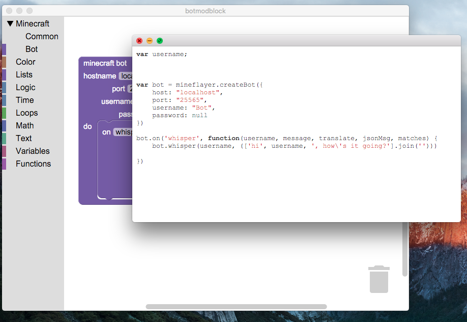

# botmodblock

Learn Computer Science through Minecraft.

# NOT AT ALL COMPLETE - STILL IN PROGRESS

This is a framework for interacting with minecraft, on the server & client side.  You can make bots that do things a player can, or change how the server works. You can use [blockly](https://developers.google.com/blockly/) for both.

## usage

Right now, it only has the beginnings of bot support. You can open/save XML files that represent the block diagrams, and you can view/run generated code. Once I finish the bot support, I'll add some cool examples to make it easier to get started.

## development

Run `npm install` to get dependencies, and `npm start` to start the local server. `npm run build` wil build the releases.

### minecraft server

You will need to setup a [scriptcraft](http://scriptcraftjs.org/) server to run server-side mod code, and although you can run bots on any server running 1.8, it's going to be easier to just setup your own. [Here](https://github.com/walterhiggins/ScriptCraft/blob/master/README.md) is a great guide for getting started with that. Definitely go the canarymod route, as this code has only been tested with that (not bukkit.) Use version 1.8 so bots will work.

#### todo

##### features

-  [ ] complete support for [mineflayer](https://github.com/PrismarineJS/mineflayer)
-  [ ] use these: mineflayer-blockfinder, mineflayer-navigate, mineflayer-scaffold
-  [ ] reference vars for "time" blocks, so they can be canceled
-  [ ] callback arguments added automatically to variable list
-  [ ] turtle-like commands for bot
-  [ ] use `utils.val()` for every val usage
-  [ ] improve run error-handling & timeout
-  [ ] seperate build into sub-project & use prune option for electron-packager
-  [ ] figure out branding
-  [ ] auto-update code window (so it updates when you make changes to blocks)
-  [ ] follow ideas [here](https://www.youtube.com/watch?v=H4sSldXv_S4) to make better editor, 2-way block/code, helpful hints & challenge framework & safer server-side thread (detect endless loops, etc.) Huge updates & will have to drop blockly, which is big.
-  [ ] update minecraft version (relies on [this](https://github.com/PrismarineJS/prismarine-chunk/issues/19) to be resolved)
-  [ ] count bots to avoid var collision (`var bot1 = ...`, `var bot2 = ...`, etc)
-  [X] use electron-packager ignore to get node_modules down to the bare minimum
-  [X] better eval with `new Function()`, drop vm2
-  [X] add backend run support
-  [X] get it running as standalone app in electron
-  [X] add block factory to app as menu option (for faster building of blocks)
-  [X] write validation functions in `util` for in-block & top-is-bot

##### inspiration

copy ideas from these:

-  [ ] [App Inventor](http://ai2.appinventor.mit.edu/) (especially with procedures) ([source](https://github.com/mit-cml/appinventor-sources))
-  [ ] [code studio](https://studio.code.org). I like what they do with callbacks in flappybird
-  [ ] [modmaker](http://inspiredtoeducate.net/modmaker/)
-  [ ] copy block factory idea for default `any` values for Inputs instead of text-fields

##### demos

-  [ ] implement [helperbot](https://www.npmjs.com/package/helperbot) in blocks
-  [ ] implement [rbot](https://github.com/rom1504/rbot) in blocks
