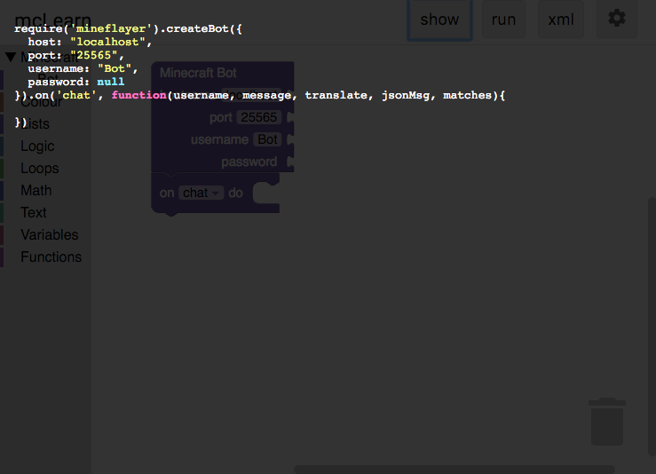

# botmodblock

Learn Computer Science through Minecraft.

# NOT AT ALL COMPLETE - STILL IN PROGRESS

This is a framework for interacting with minecraft, on the server & client side.  You can make bots that act like a player, or change how the server works. You can use [blockly](https://developers.google.com/blockly/) or javascript for both.

## setup

Run `npm install` to get dependencies, and `npm start` to start the local server.

### server

You will need to setup a [scriptcraft](http://scriptcraftjs.org/) server to run server-side code. [Here](https://github.com/walterhiggins/ScriptCraft/blob/master/README.md) is a great guide for getting started with that. Defintely go the canarymod route, as this code has only been tested with that (not bukkit.)

#### todo

-  [ ] complete support for [mineflayer](https://github.com/PrismarineJS/mineflayer)
-  [ ] get ideas from [here](http://inspiredtoeducate.net/modmaker/)
-  [ ] use these: mineflayer-blockfinder, mineflayer-navigate, mineflayer-scaffold
-  [ ] look at [App Inventor](http://ai2.appinventor.mit.edu/) for inspiration (especially with procedures) ([source](https://github.com/mit-cml/appinventor-sources))
